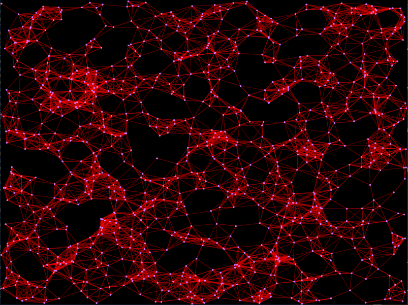

# eNeRGy
eNeRGy is a Node Relationship Graphing tool. Used to represent relationships between objects. It is still very much under construction.

It is written in rust. The rendering library used is [macroquad](https://macroquad.rs).  
This project focuses on performance and efficiency to be able to handle as much data as possible.

## Usage:
* Make sure you have [Rust](https://www.rust-lang.org/tools/install)) installed
* [Clone the repository using git](https://docs.github.com/en/repositories/creating-and-managing-repositories/cloning-a-repository), or download it manually 
* Navigate to the project folder in your terminal of choice
* Run `$ cargo run --release`

Building with the `--release` flag is reccomended, as it allows for rendering a significantly greater ammount of nodes.
  
Here is an example way to complete the above steps:
`$ cargo --version`  
`$ git clone https://github.com/nkct/eNeRGy.git`  
`$ cd ./eNeRGy`  
`$ cargo run --release`  

The `NODE_NUM` variable at the top of `main.rs` controls the ammount of nodes generated. It is reccomended to not go above 1000, as that might take an excruciatingly long time.  
Building with the `cheap_dragging` feature should result in less computationally intensive dragging of nodes. At the cost of less impressive visuals.

## Contributions:
All contributions, issues, and messages are welcome! If you aren't sure about something or have any questions please reach out to me.
